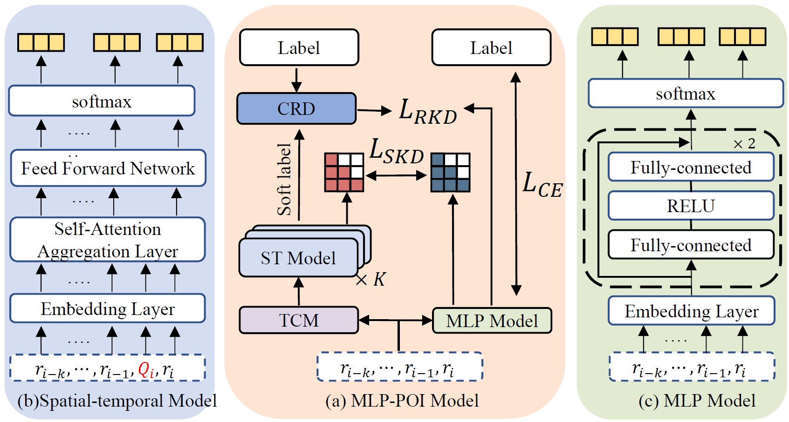
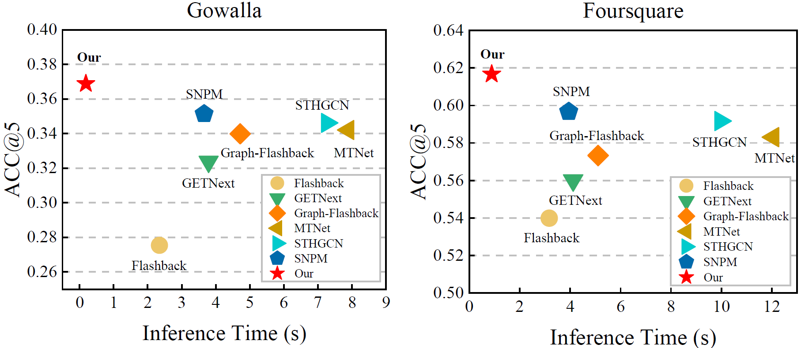

# GASTD: Graph-Augmented Spatial-Temporal Distillation for Efficient Next POI Recommendation

# Requirements
```
pip install -r requirements.txt
```

# Data Preparation

**1. place [flashback_data.zip](https://drive.google.com/file/d/1QXdpp0_QesJo7NZdhvoafg4MlpI_Bx-O/view?usp=sharing) into /data/ and unzip the file as following:**

/data/checkins-gowalla.txt

/data/checkins-4sq.txt

<!-- https://drive.google.com/file/d/1ST6GQidWVlR6yQle38MfPUSUc29t9xIT/view?usp=sharing -->

**2. place [Graphs.zip](https://drive.google.com/file/d/1KC361Gq-K-0Aw7xu5pyl51YOgMK9JtMb/view?usp=sharing) into Graph_Flashback/KGE/ and unzip the file as following :**

/KGE/Graphs/gowalla_scheme2_transe_loc_temporal_100.pkl

# Model Training

```
python train.py
```

# Motivation

The findings from the data visualization analysis are as follows: (a) the student model derived from standard knowledge distillation lacks confidence, (b) its prediction errors are concentrated in high-entropy regions of the teacher model, and (c) the student's confidence decreases as the teacher's entropy increases. These insights motivate us to enhance the student's confidence to improve its lightweight prediction accuracy. 


# Trajectory Completion Module (TCM)

To enhance the spatial-temporal information and confidence of the student model, we mined the trajectory to identify potentially missing check-ins.


# Efficiency

We leveraged a reliable multi-teacher knowledge distillation framework, which not only improved the prediction accuracy of the student model but also retained its efficiency advantage.
